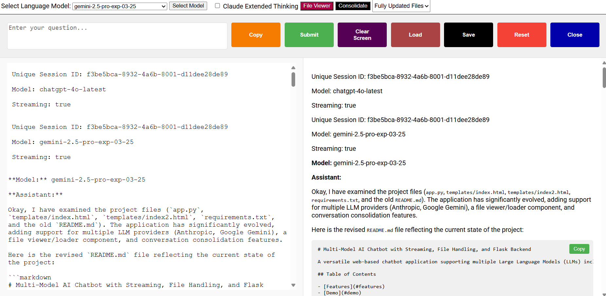

# Multi-Model AI Chatbot with Streaming, File Viewer, and Conversation Management

A powerful, extensible web-based chatbot supporting multiple Large Language Models (LLMs) including OpenAI (chatgpt-4o-latest, GPT-4o, GPT-4.1, o4-mini, o3, o1-pro), Anthropic (Claude), and Google (Gemini). Features real-time streaming, advanced conversation management, Markdown/code/math rendering, and a unique file viewer for loading local project files directly into the chat context.

**New:** A trimmed-down version (`app_new.py`) is now available, focused exclusively on OpenAI's reasoning models (o3 and o1-pro) using the Responses API.

---

## Features

- **Multi-Model Support**  
  Seamlessly switch between:
  - **OpenAI**: `chatgpt-4o-latest`, `gpt-4o`, `gpt-4.1`, `o4-mini`, `o3`, `o1-pro`
  - **Anthropic**: `claude-3-7-sonnet-20250219`
  - **Google**: `gemini-2.5-flash-preview-04-17`, `gemini-2.5-pro-preview-05-06`

- **Real-Time Streaming**  
  Receive responses token-by-token for most models, for a fast, interactive experience.

- **Integrated File Viewer & Loader**  
  - Browse your local folders (server-side, via Tkinter dialog).
  - Select and load multiple code/text files (`.py`, `.js`, `.html`, `.css`, `.md`, `.txt`, etc.).
  - Concatenated file contents are injected into your next chat prompt for context-aware code review, refactoring, or Q&A.

- **Conversation Management**
  - **Save**: Store conversations as both JSON (for reloading) and Markdown (for easy reading/sharing).
  - **Load**: Restore previous conversations in a new tab.
  - **Reset**: Start a new branch of conversation within the same session.
  - **Clear Screen**: Wipe the UI without affecting backend history.

- **Conversation Consolidation**
  - Start a new session pre-filled with a prompt to consolidate, refactor, critique, or summarize the previous conversation and loaded files.

- **Rich Output Rendering**
  - Markdown with syntax-highlighted code blocks (Highlight.js).
  - MathJax for LaTeX-style math rendering.
  - "Copy" buttons for code blocks and full prompt (including loaded files).

- **Model-Specific Features**
  - Toggle Anthropic Claude's "Extended Thinking" mode.
  - Toggle math rendering/escaping.

- **Session Isolation**
  - Each browser tab/session has its own unique conversation state.

- **Graceful Server Shutdown**
  - Save all active conversations and terminate the server from the UI (for development use).

---

## Demo



---

## Quick Start

### Prerequisites

- Python 3.7+
- pip
- (Optional) Tkinter (for file dialog; usually included with Python, but may require `sudo apt-get install python3-tk` on some Linux systems)

### Installation

1. **Clone the repository**
    ```bash
    git clone https://github.com/EjayNg-AI/openai-flask-chatbot.git
    cd openai-flask-chatbot
    ```

2. **Create and activate a virtual environment**
    ```bash
    python3 -m venv venv
    source venv/bin/activate  # On Windows: venv\Scripts\activate
    ```

3. **Install dependencies**
    ```bash
    pip install -r requirements.txt
    ```

4. **Configure environment variables**  
   Create a `.env` file in the project root:
    ```
    FLASK_SECRET_KEY=your_flask_secret
    OPENAI_API_KEY=your_openai_key
    ANTHROPIC_API_KEY=your_anthropic_key
    GEMINI_API_KEY=your_gemini_key
    ```
   - Only provide keys for the services you want to use.

5. **Run the application**
    ```bash
    python app.py
    ```
   - The server will auto-select an available port (starting from 5000).
   - Open `http://127.0.0.1:PORT/` in your browser.

---

## Usage Overview

### Main Chat Interface

- **Model Selection**: Use the dropdown to pick your LLM. Click "Select Model" to apply.
- **Claude Extended Thinking**: Toggle for Anthropic models.
- **Math Rendering**: Toggle to escape output and render LaTeX math.
- **File Viewer**: Opens a new window to browse and select files for context injection.
- **Consolidate**: Opens a new tab with a pre-filled prompt for codebase consolidation, refactoring, critique, or synopsis.
- **Prompt Input**: Type your question or request. Use "Copy Prompt" to see/copy the full prompt (including loaded files).
- **Submit**: Sends your prompt (and any loaded file content) to the selected model.
- **Save/Load/Reset/Clear/Close**: Manage conversation state and server lifecycle.

### File Viewer

- **Open Folder**: Launches a native folder picker (server-side).
- **Directory Tree**: Browse and select files (checkboxes).
- **Load Selection**: Loads and concatenates selected files, sending them to the main chat window.
- **Refresh**: Reloads the directory tree.
- **Clear**: Clears loaded file content from both the viewer and the main chat.

### Conversation Consolidation

- After a session (especially after loading files), use the "Consolidate" dropdown and button to:
  - Generate fully updated files
  - Refactor code
  - Critique code
  - Summarize the project
- A new tab opens with the conversation history and a pre-filled prompt for the chosen task.

---

## Project Structure

```
openai-flask-chatbot/
├── app.py                  # Flask backend, LLM API logic, file handling (full version)
├── app_new.py              # Trimmed backend - o3 and o1-pro only
├── templates/
│   ├── index.html          # Main chat UI (full version)
│   ├── index_new.html      # Trimmed chat UI for o3/o1-pro
│   ├── index2.html         # File viewer UI (full version)
│   └── index2_new.html     # File viewer UI for trimmed version
├── conversations/          # Saved conversations (auto-created)
├── requirements.txt
├── .env                    # Your API keys (not committed)
├── .gitignore              # Git ignore rules
├── AGENTS.md               # Repository guidelines for AI agents
├── CLAUDE_INSTRUCTIONS.md  # Claude Code-specific instructions
└── README.md
```

### Two Versions Available

| Version | Entry Point | Models | Use Case |
|---------|-------------|--------|----------|
| **Full** | `python app.py` | GPT-4o, GPT-4.1, o3, o4-mini, o1-pro, Claude, Gemini | All features, multiple providers |
| **Trimmed** | `python app_new.py` | o3, o1-pro only | Focused reasoning model usage |

---

## Advanced Details

- **Session Management**: Each tab gets a unique session ID; conversation history is isolated.
- **Conversation Storage**:
  - `[name]messages.json`: User/assistant messages for reloading.
  - `[name].md`: Markdown log of the conversation.
  - `[name]all.json`: Full internal state (for debugging).
- **File Types**: File viewer supports `.py`, `.js`, `.html`, `.css`, `.md`, `.txt`, `.json`, `.ipynb`, etc. (see `app.py` for full list).
- **Streaming**: Uses Server-Sent Events (SSE) for real-time updates (full version). The trimmed version uses non-streaming Responses API.
- **Security**:
  - API keys are loaded from `.env` and never exposed to the frontend.
  - The shutdown endpoint is for development only—do not expose in production.

### Trimmed Version Details

The `app_new.py` version provides a streamlined experience for OpenAI's reasoning models:

- **Models**: Only `o3` and `o1-pro` (high reasoning effort enabled)
- **API**: Uses OpenAI Responses API with `store=True` for conversation persistence
- **No streaming**: Both models return complete responses
- **Simplified UI**: Removed Claude Extended Thinking toggle and non-applicable model options

---

## Troubleshooting

- **API Errors**: Check your `.env` and `app.log` for missing/invalid keys.
- **Tkinter/File Dialog**: Requires a desktop environment on the server. Not suitable for headless servers.
- **File Viewer Sync**: Main chat window must remain open for file content injection.
- **Port Conflicts**: The app will auto-select an available port starting from 5000.
- **Permissions**: Ensure the app can write to the project directory for saving conversations and logs.

---

## License

MIT License. See LICENSE file.

---

**Disclaimer:**  
This app interacts with external APIs and your local files (via server-side dialogs). Use with care. The shutdown feature is for development only.
