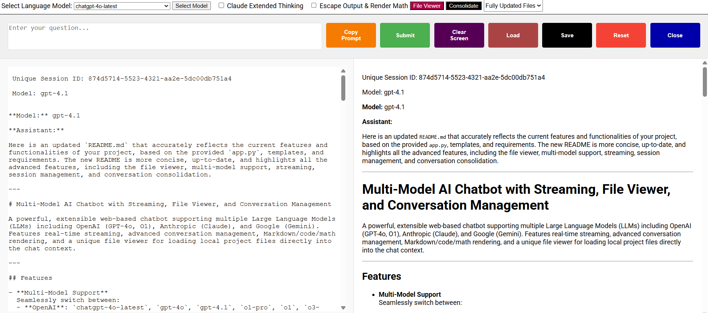

# OpenAI Streaming Chatbot with Flask Backend

A web-based chatbot application powered by OpenAI's API, featuring real-time streaming responses. Built with Python's Flask framework for the backend and a responsive frontend using HTML, CSS, and JavaScript.

## Table of Contents

- [Features](#features)
- [Demo](#demo)
- [Installation](#installation)
  - [Prerequisites](#prerequisites)
  - [Setup](#setup)
- [Configuration](#configuration)
- [Usage](#usage)
  - [Accessing the Chatbot](#accessing-the-chatbot)
  - [Interacting with the Chatbot](#interacting-with-the-chatbot)
  - [Managing Conversations](#managing-conversations)
  - [Server Shutdown](#server-shutdown)
- [Project Structure](#project-structure)
- [How It Works](#how-it-works)
  - [Backend (Flask)](#backend-flask)
  - [Frontend](#frontend)
- [Troubleshooting](#troubleshooting)
- [License](#license)

## Features

- **Real-Time Streaming:** Receive responses from OpenAI's API as they're generated.
- **Conversation Saving:** Save conversations for future reference.
- **Responsive Interface:** Intuitive UI built with modern web technologies.
- **Markdown & Math Support:** Render rich text, code snippets, and mathematical equations.
- **Secure Shutdown:** Terminate the server gracefully when done.

## Demo



## Installation

### Prerequisites

- **Python 3.7 or higher**
- **pip** (Python package installer)
- **Git** (for cloning the repository)

### Setup

1. **Clone the Repository**

   ```bash
   git clone https://github.com/EjayNg-AI/openai-flask-chatbot.git
   cd openai-flask-chatbot
   ```

2. **Create a Virtual Environment**

   It's recommended to use a virtual environment to manage dependencies.

   ```bash
   python3 -m venv venv
   source venv/bin/activate  # On Windows: venv\Scripts\activate
   ```

3. **Install Dependencies**

   ```bash
   pip install -r requirements.txt
   ```

4. **Set Up Environment Variables**

   Create a `.env` file in the project root directory and add the following variables:

   ```env
   FLASK_SECRET_KEY=your_flask_secret_key
   OPENAI_API_KEY=your_openai_api_key
   ```

   - `FLASK_SECRET_KEY`: A secret key for Flask sessions.
   - `OPENAI_API_KEY`: Your OpenAI API key.

5. **Run the Application**

   ```bash
   python app.py
   ```

   The server will start on `http://127.0.0.1:5000/`.

## Configuration

Ensure the `.env` file contains the necessary environment variables:

- **FLASK_SECRET_KEY:** A strong secret key for securing Flask sessions.
- **OPENAI_API_KEY:** Your OpenAI API key to access the GPT models.

Example `.env` file:

```env
FLASK_SECRET_KEY=supersecretkey123
OPENAI_API_KEY=sk-XXXXXXXXXXXXXXXXXXXXXXXXXXXX
```

## Usage

### Accessing the Chatbot

Navigate to `http://127.0.0.1:5000/` in your web browser to access the chatbot interface.

You may open multiple tab interfaces in your browser, or across multiple browsers.

### Interacting with the Chatbot

1. **Enter Your Query:**
   - Use the input area at the top to type your question or prompt.
   - The input box auto-resizes based on your input.

2. **Submit Your Query:**
   - Click the **Submit** button or press `Ctrl + Enter` to send your message.
   - The chatbot will respond in real-time with streaming output.

### Managing Conversations

- **Save Conversation:**
  - Click the **Save** button to store the current conversation.
  - You'll be prompted to enter a name for the conversation.
  
- **Reset Conversation:**
  - Click the **Reset** button to clear the current conversation and start fresh.

### Server Shutdown

> **⚠️ Warning:** The shutdown feature is intended for development purposes only. It should not be included in a production environment.

- **Shut Down the Server:**
  - Click the **Close** button.
  - The server will terminate gracefully.

## Project Structure

```
openai-flask-chatbot/
├── app.py
├── templates/
│   └── index.html
├── conversations/
├── .env
├── requirements.txt
└── README.md
└── screenshot.png
```

- **app.py:** The main Flask application handling backend logic and API routes.
- **templates/index.html:** The frontend HTML template for the chatbot interface.
- **conversations/:** Stores saved conversation data.
- **.env:** Environment variables configuration file.
- **requirements.txt:** Python dependencies.
- **README.md:** Project documentation.

## How It Works

### Backend (Flask)

- **Flask Application:** Serves the frontend and handles API routes for streaming responses, saving conversations, and server management.
- **Session Management:** Utilizes Flask sessions to track conversation history and unique session IDs.
- **OpenAI Integration:** Communicates with OpenAI's API to generate chatbot responses, enabling streaming of messages for real-time interaction.
- **Conversation Storage:** Saves conversations in both JSON and Markdown formats for easy retrieval and readability.
- **Secure Shutdown:** Implements an endpoint to shut down the server gracefully.

### Frontend

- **Responsive Design:** Built with HTML, CSS (using Roboto font), and JavaScript to ensure a seamless user experience across devices.
- **User Interface Components:**
  - **Control Panel:** Contains input fields and buttons for submitting queries, saving conversations, and resetting or shutting down the server.
  - **Conversation Display:** Shows the conversation history with support for Markdown rendering, syntax highlighting, and mathematical equations via MathJax.
- **Real-Time Streaming:** Utilizes Server-Sent Events (SSE) to receive and display streaming responses from the backend.
- **Enhanced Features:**
  - **Auto-Resizing Input:** The query input box adjusts its height based on user input.
  - **Copy Code Snippets:** Allows users to copy code blocks with a single click.
  - **Markdown Preview:** Renders Markdown content dynamically as the conversation progresses.

## Troubleshooting

- **Missing Environment Variables:**
  - Ensure all required variables are set in the `.env` file.
  
- **OpenAI API Errors:**
  - Verify that the `OPENAI_API_KEY` is correct and has sufficient permissions.
  
- **Port Conflicts:**
  - If port `5000` is in use, modify the `app.py` to use a different port.

## License

This project is licensed under the [MIT License](LICENSE).

---

**Disclaimer:** This application is for educational and development purposes. Ensure you handle API keys and secret tokens securely, especially in production environments.